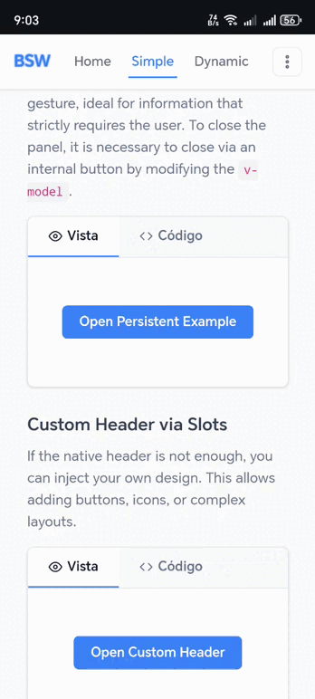
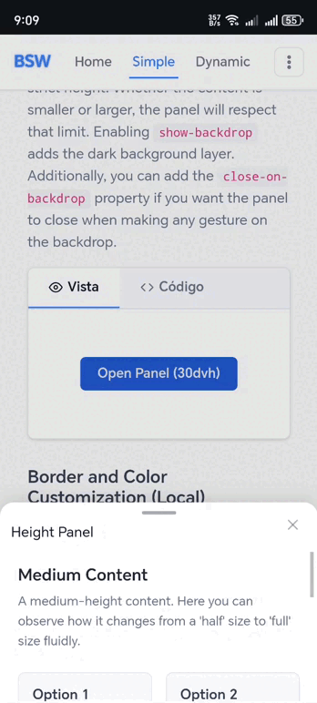

# 📱 Bottom Sheet Wrappers — v2

A flexible and powerful Vue 3 bottom sheet library designed specifically for **mobile devices** with native-like touch gesture support and two distinct display modes.

> ⚡ **Version 2** introduces a simplified API with new component names (`BsDynamic`, `BsSimple`) and no plugin registration required — just import and use.

[](https://www.npmjs.com/package/@coderoycc/bottom-sheet-wrappers)
[](https://opensource.org/licenses/MIT)

> 📱 **Mobile-First Design**: Built from the ground up for mobile devices with smooth 60fps animations and native-like touch interactions. <a href="https://coderoycc.github.io/bsw-demo/">Full Documentation & Demo →</a>

## ✨ Features

- 🎯 **Two Distinct Components**: `BsDynamic` (resizable with snap points) and `BsSimple` (static height or auto-fit).
- 👆 **Native Touch Gestures**: Smooth swipe, drag, and tap interactions optimized for mobile.
- 🎨 **Customizable Backdrop**: Optional backdrop with configurable behavior.
- 📱 **Mobile-First & Responsive**: Optimized for mobile devices, works great on desktop too.
- 🔧 **TypeScript Support**: Full TypeScript definitions included.
- 🪶 **Lightweight**: Minimal dependencies (only Vue 3).
- ♿ **Accessible**: ARIA support and keyboard interaction ready.
- ⚡ **Performant**: 60fps animations with GPU acceleration.

## 📦 Installation

```bash
npm install @coderoycc/bottom-sheet-wrappers
```

Or with yarn:

```bash
yarn add @coderoycc/bottom-sheet-wrappers
```

Or with pnpm:

```bash
pnpm add @coderoycc/bottom-sheet-wrappers
```

## 🚀 Quick Start

### 1. Import the styles

Import the styles **once** in your entry file (`main.ts`) or at the top of the component where you need them. This must be done **before** using any component:

```typescript
// main.ts
import "@coderoycc/bottom-sheet-wrappers/style.css";
```

### 2. Import and use the components directly

No plugin registration needed — simply import the component you want and use it:

```vue
<script setup>
import { ref } from "vue";
import { BsDynamic } from "@coderoycc/bottom-sheet-wrappers";

const isOpen = ref(false);
</script>

<template>
  <button @click="isOpen = true">Open Bottom Sheet</button>

  <BsDynamic v-model="isOpen" title="My Bottom Sheet">
    <p>Your content here</p>
  </BsDynamic>
</template>
```

> 💡 You can also import the styles directly in the component's `<style>` block or in a dedicated CSS entry file.

## 🎭 Display Modes

The library consists of two main components acting as distinct modes to perfectly match your use case:

### 1. Dynamic Bottom Sheet (`BsDynamic`)

This mode allows the user to resize the sheet by dragging up or down between three size states: `collapsed`, `half`, and `full`. It supports a mini-player pattern out of the box.



```vue
<script setup>
import { ref } from 'vue';
import { BsDynamic } from '@coderoycc/bottom-sheet-wrappers';

const isDynamicOpen = ref(false);
</script>

<template>
  <BsDynamic
    v-model="isDynamicOpen"
    initial-size="half"
    half="45dvh"
    full="95dvh"
    @size-change="onSizeChange"
  >
    <p>Swipe up or down to resize content</p>

    <!-- Optional collapsed slot for a mini-player/bar view -->
    <template #collapsed-content>
      <div>Now Playing...</div>
    </template>
  </BsDynamic>
</template>
```

**Behavior:**
- ✅ Swipe up/down to resize through specific snap points.
- ✅ Handles its own internal sizes accurately mapping to your UI expectations (`half`, `full`).
- ✅ Provides a seamless collapsed state for a "mini view" via `#collapsed-content` slot.
- ✅ Smart expansion boundaries that block accidental full expansion when limits are hit.

---

### 2. Simple Bottom Sheet (`BsSimple`)

This mode maintains a fixed or auto-adjusted height (based on the content inside it) and **cannot be resized**, though the user can swipe down to close it. Perfectly covers both fixed-size and auto-fit use cases.



```vue
<script setup>
import { ref } from 'vue';
import { BsSimple } from '@coderoycc/bottom-sheet-wrappers';

const isSimpleOpen = ref(false);
</script>

<template>
  <!-- Provide a specific height -->
  <BsSimple v-model="isSimpleOpen" title="Fixed Sheet" height="50dvh">
    <p>Fixed at 50% screen height</p>
  </BsSimple>

  <!-- Or let it auto-adjust (auto-fit behavior) by omitting height -->
  <BsSimple v-model="isSimpleOpen" title="Auto Sheet">
    <p>My height adjusts automatically to fit this content!</p>
  </BsSimple>
</template>
```

**Behavior:**
- ✅ Fixed height or Auto-Height fallback depending on the provided `height` prop.
- ✅ Swipe down on the handle to close directly.
- ✅ No internal resizing gestures enabled, maintaining focused view boundaries.
- ✅ Optional persistent mode to prevent closing via gestures.

## 📚 API Reference

### BsDynamic

#### Props
| Prop | Type | Default | Description |
| ---- | ---- | ------- | ----------- |
| `modelValue` | `boolean` | `false` | Controls visibility (`v-model`). |
| `title` | `string` | `''` | Header title string. |
| `initialSize` | `'collapsed' \| 'half' \| 'full'` | `'half'` | Starting size when the sheet opens. |
| `half` | `string` | `'45dvh'` | Height when mapped to the `half` size. |
| `full` | `string` | `'95dvh'` | Height when mapped to the `full` size. |
| `hideCloseButton` | `boolean` | `false` | Hide the close icon button in the top right. |
| `showBackdrop` | `boolean` | `false` | Render a dark visual backdrop behind the sheet. |
| `hideDragHandle` | `boolean` | `false` | Hide the drag handle indicator. |
| `zIndex` | `number` | `1` | Added over a base `9000` context z-index layer. |

#### Events
| Event | Payload | Description |
| ----- | ------- | ----------- |
| `update:modelValue` | `boolean` | Emitted when visibility changes. |
| `opened` | — | Emitted when sheet is fully open and mounted. |
| `closed` | — | Emitted when fully unloaded/closed. |
| `close` | — | Triggered right before closing starts. |
| `size-change` | `'collapsed' \| 'half' \| 'full'` | Emitted when the sheet switches to a new size mode. |

#### Methods & Slots
**Methods (via Template Ref):** `open()`, `close()`, `animateToSize(size)`  
**Slots:** `#default`, `#header`, `#collapsed-content`

---

### BsSimple

#### Props
| Prop | Type | Default | Description |
| ---- | ---- | ------- | ----------- |
| `modelValue` | `boolean` | `false` | Controls visibility (`v-model`). |
| `title` | `string` | `''` | Header title string. |
| `height` | `string \| number` | `undefined` | Forced static height. Omitting this makes it auto-fit the content inside. |
| `showBackdrop` | `boolean` | `false` | Render a dark visual backdrop. |
| `hideCloseButton` | `boolean` | `false` | Hide the close icon button. |
| `hideDragHandle` | `boolean` | `false` | Hide the drag handle indicator. |
| `closeOnBackdrop` | `boolean` | `false` | Close the sheet when clicking the backdrop. |
| `persistent` | `boolean` | `false` | Prevent closing via gestures and hides the close button. |
| `zIndex` | `number` | `0` | Added over a base `9000` context z-index layer. |

#### Events
| Event | Payload | Description |
| ----- | ------- | ----------- |
| `update:modelValue` | `boolean` | Emitted when visibility changes. |
| `opened` | — | Emitted when sheet is fully created & mounted in active state. |
| `closed` | — | Emitted when fully unloaded/closed. |
| `before-close` | — | Emitted when the closing sequence begins. |

#### Methods & Slots
**Slots:** `#default`, `#header`

## 🎨 Styling

You can override the default styles using CSS variables or by targeting the component classes directly.

```css
/* Custom backdrop opacity */
.bsw-bottom-sheet-backdrop--visible {
  background: rgba(0, 0, 0, 0.75) !important;
}

/* Custom handle color */
.bsw-bottom-sheet-handle {
  background: #007bff !important;
}
```

### Dark Mode Support
The components naturally embrace CSS scopes for overrides, simply wrap components or nest logic within your specific theme identifiers:
```vue
<BsDynamic v-model="isOpen" class="my-dark-theme">
  <p>Content</p>
</BsDynamic>

<style>
.my-dark-theme .bsw-bottom-sheet-panel {
  background: #1a1a1a;
  color: #ffffff;
}
</style>
```

## 🏗️ Architecture

The library is built with clean code principles using Vue 3's Composition API structure:

- `BsDynamic` & `BsSimple` logic separated for specialized behavior.
- Use of internal composables (e.g., `useDynamicGestures`, `useSimpleGestures`, `useAutoHeight`) to decouple gesture tracking and size orchestration.

## 📖 Documentation

Full interactive documentation and live examples are available at:  
**[https://coderoycc.github.io/bsw-demo/](https://coderoycc.github.io/bsw-demo/)**

## 🤝 Contributing

Contributions are welcome! Please feel free to submit a Pull Request.

## 📄 License

MIT License - see [LICENSE](LICENSE) file for details

## 👤 Author

**coderoycc**

- GitHub: [@coderoycc](https://github.com/coderoycc)
- npm: [@coderoycc](https://www.npmjs.com/~coderoycc)

---

Made with ❤️ by coderoycc
